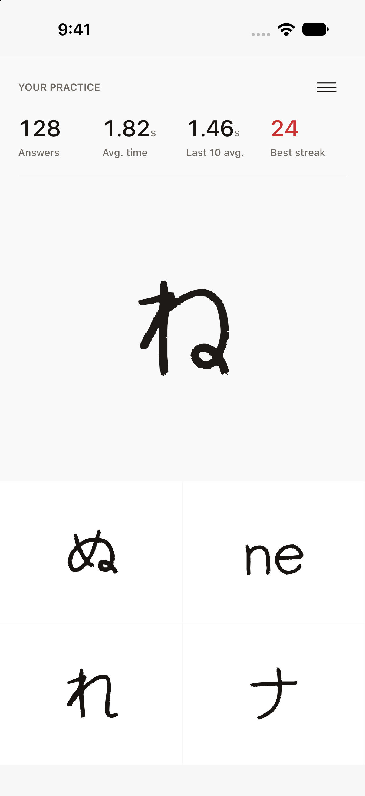
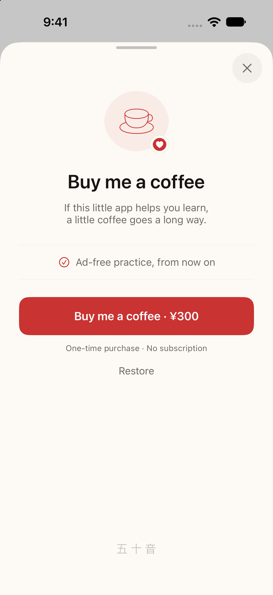
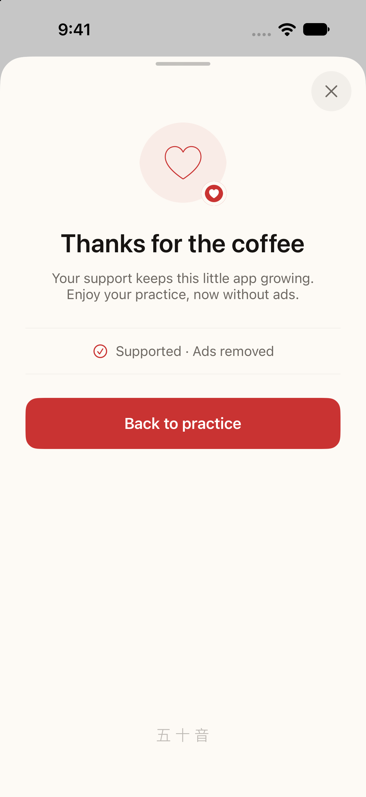

# Kana · 五十音

A small iPhone and iPad app for practising Japanese kana. Match hiragana,
katakana, and romaji in quick, handwritten quizzes.

[App Store](https://apps.apple.com/app/id1195345471) · [Website](https://kana.jacky.jp/)

- Four answers per question, with feedback when an answer is wrong or time runs out.
- A quiet statistics bar: answers, average time, the last ten answers, and best streak.
- A kana chart, available from the menu button or a pull-down gesture.
- **Buy me a coffee**: an optional, one-time purchase that removes ads, with purchase restore.
- English, Japanese, Simplified Chinese, Traditional Chinese, Korean, German, French, and Spanish.

## Screenshots

| Practice | Coffee support | Thank you |
| --- | --- | --- |
|  |  |  |

Native iPhone simulator captures with sample statistics and a local StoreKit test
purchase. See [the design notes](design/README.md) for Chinese, Japanese, and iPad
screenshots, the interactive preview, and capture instructions.

## Build and test

Use Xcode 27 and XcodeGen. The app supports iOS 15 and later.

```sh
xcodegen generate --spec source/kana/project.yml
xcodebuild test \
  -project source/kana/kana.xcodeproj \
  -scheme kana \
  -destination 'platform=iOS Simulator,name=iPhone 18 Pro' \
  -parallel-testing-enabled NO
```

The scheme uses `Configuration.storekit` for local purchases when launched from
Xcode. StoreKit unit tests create their own test session. Screenshot tests run
only when their capture environment is configured.

The public website lives in [site/](site/README.md).
