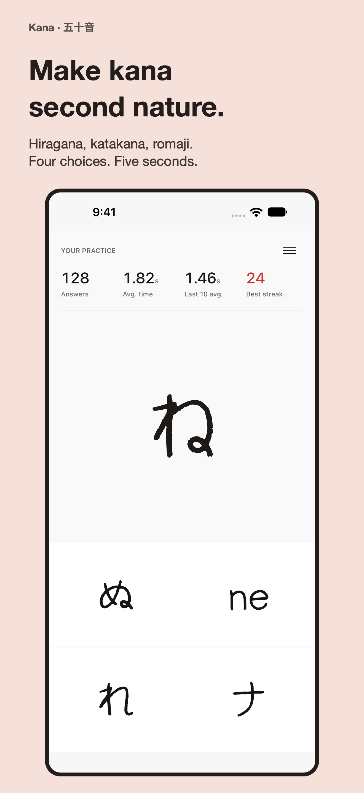
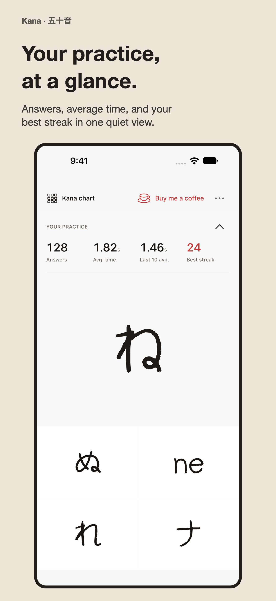
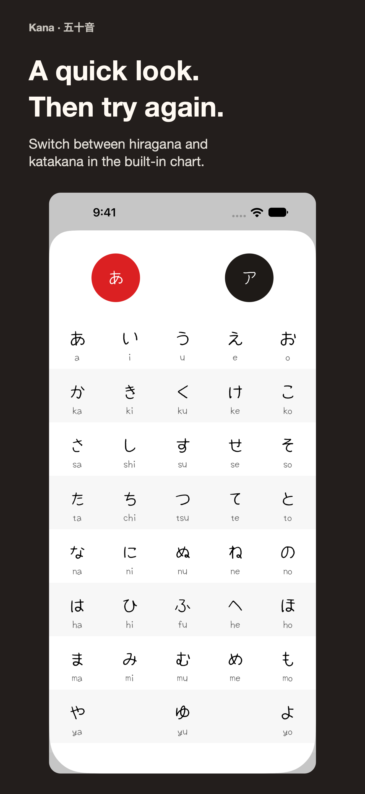
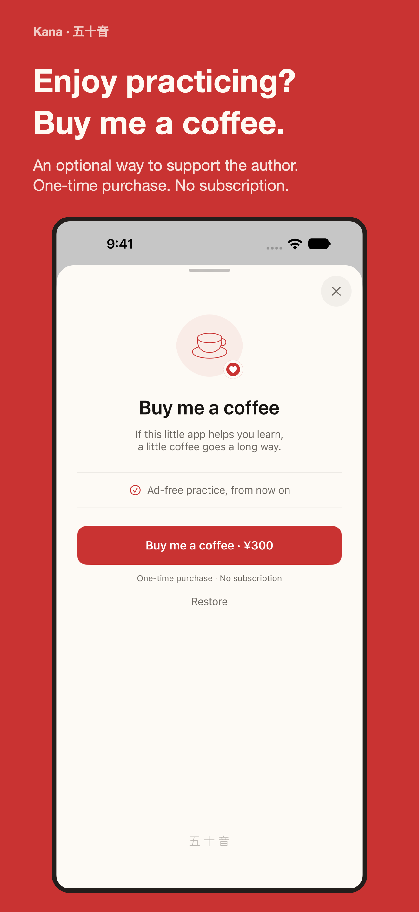

# Kana · 五十音

Four choices. Five seconds. How long can you keep your streak?

Kana is a small iOS and Android app for reading basic Japanese kana. Match
hiragana, katakana, and romaji, and try to beat your record.

[App Store](https://apps.apple.com/app/id1195345471) · [Google Play](https://play.google.com/store/apps/details?id=jp.jacky.kana) · [Website](https://kana.jacky.jp/)

- Four answers and five seconds per question. Incorrect answers and timeouts reveal the correct answer.
- Practice statistics: answer count, average time, the average for the last ten answers, and best streak.
- A kana chart with hiragana, katakana, and romaji. The timer pauses while the menu or a sheet is open.
- Offline practice with no account required. Practice statistics stay on the device.
- Ads appear only after an incorrect answer or a timeout.
- **Buy me a coffee**: optional support for the author through a one-time purchase, with no subscription.
- English, Japanese, Simplified Chinese, Traditional Chinese, Korean, German, French, and Spanish.

## Screenshots

| Practice | Statistics | Kana chart | Coffee support |
| --- | --- | --- | --- |
|  |  |  |  |

Store artwork uses native simulator captures with sample statistics and a local
StoreKit price. See [the store materials](store/README.md) for five languages,
iPhone and iPad layouts, and the HTML preview. The
[Android store materials](store/android/README.md) use native Compose captures
for phones and tablets. [The design notes](design/README.md) cover native UI
states and capture instructions.

## Release status

Android **1.0.0 (2)** passed Google Play review, as confirmed by the owner on
September 29, 2026. The target audience is **13+**. Automatic full rollout was
configured at submission. Public availability remains to be verified.
See the [release record](docs/releases/2026-09-28-android-review.md)
for validation and remaining checks.

iOS **1.1.0 (17)** and the coffee purchase were submitted to App Review on
September 27, 2026. Both are **Waiting for Review** as of that date. The app will
release automatically after approval. The release includes the statistics and
coffee redesign, updated ad consent controls, and the kana chart text fix for
Dark Mode.

## Build and test

Use Xcode 27 and XcodeGen. The app supports iOS 15 and later.

```sh
xcodegen generate --spec source/kana/project.yml
xcodebuild test \
  -project source/kana/kana.xcodeproj \
  -scheme kana \
  -destination 'platform=iOS Simulator,name=iPhone 18 Pro' \
  -parallel-testing-enabled NO
```

The scheme uses `Configuration.storekit` for local purchases when launched from
Xcode. StoreKit unit tests create their own test session. Screenshot tests run
only when their capture environment is configured.

### Android

The Android app lives in [source/android](source/android/README.md) (Kotlin, Jetpack Compose,
minSdk 26). Build and test with the Gradle wrapper:

```sh
cd source/android
./gradlew :app:testDebugUnitTest :app:assembleDebug
```

The public website lives in [site/](site/README.md).

## Roadmap

See [TODO.md](TODO.md) for store availability checks, AdMob store association,
app-ads.txt verification, and the remaining device checks.
