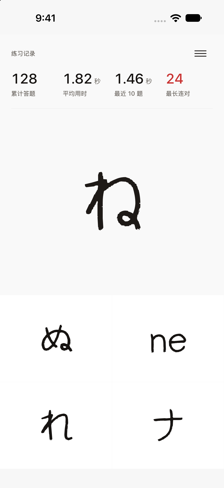
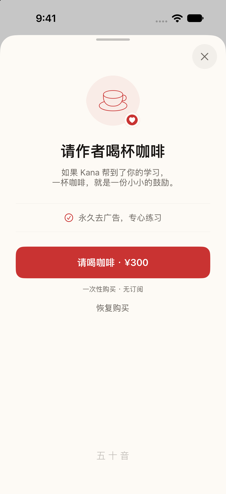
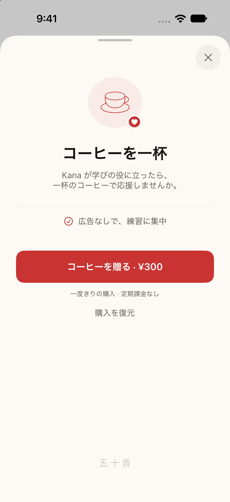
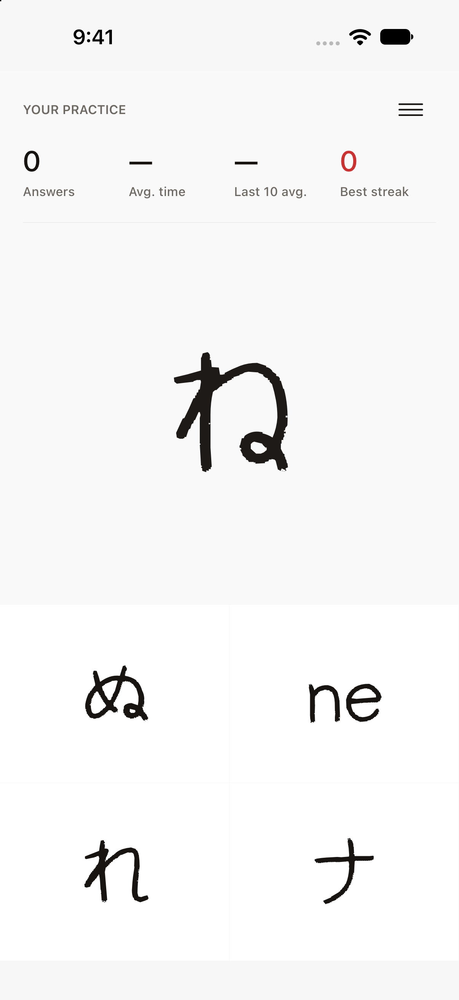
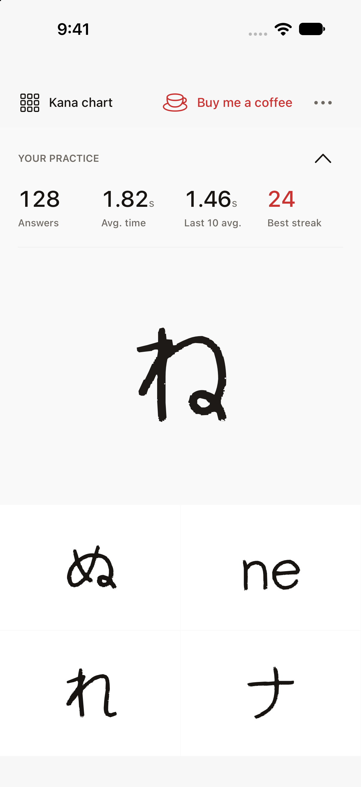
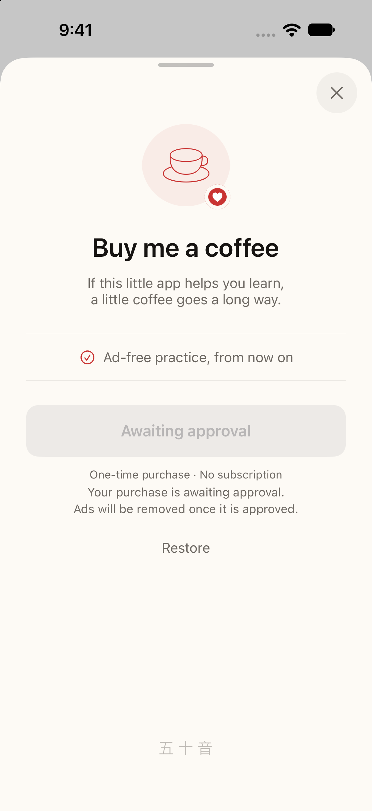
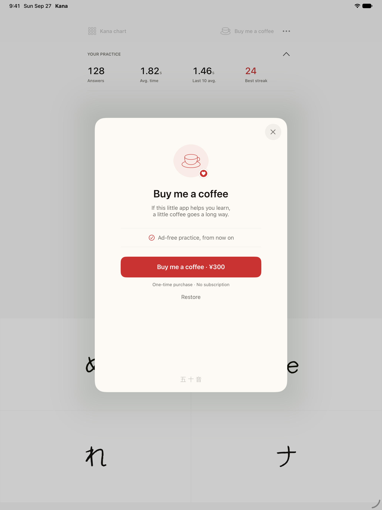

# Practice statistics and coffee support

The practice screen keeps its handwritten kana, open space, and four-answer grid.
Statistics now share one row, with tabular numbers, smaller units, and a red best
streak. Empty averages show an em dash. Each metric exposes its label and value
together to VoiceOver.

The menu has a visible button as well as the existing pull-down gesture. Kana
reference and coffee support are direct actions; sharing, feedback, and required
ad privacy controls are in the overflow menu. The question timer pauses while
the menu and its sheets are open.

**Buy me a coffee** opens a warm paper sheet with a cup illustration, a permanent
ad-removal benefit, the StoreKit price, a one-time purchase note, and restore.
Loading, retry, pending approval, cancellation, and purchase completion have
separate states. A successful purchase replaces the offer with a thank-you and
a return to practice button.

## Native screenshots

The captures use the real UIKit views on iOS 27. The practice metrics are fixed
sample values for comparison. Purchase and approval flows use StoreKitTest;
these are not production transactions.

| Chinese practice | Chinese support | Japanese support |
| --- | --- | --- |
|  |  |  |

| Empty statistics | Menu | Pending approval |
| --- | --- | --- |
|  |  |  |



## Interactive preview

Open [preview/index.html](preview/index.html) in a browser, or serve the directory:

```sh
python3 -m http.server 8796 --directory design/preview
```

The HTML file contains its fonts and icons. It supports Chinese, Japanese, and
English, sample or empty statistics, and simulated purchase states. The preview
uses a sample ¥300 price; the app uses the price returned by StoreKit.

## Capture again

Boot an iOS simulator and pass its UDID. Each run needs a new output directory.
The script runs the hosted screenshot test and captures each state with `simctl`.

```sh
python3 scripts/capture-design.py \
  --device SIMULATOR_UDID \
  --language en \
  --output /tmp/kana-captures-en
```

Use `ja` or `zh-Hans` for the other languages. Each output directory contains
seven PNGs, a test log, and an Xcode result bundle. The tests cover the empty and
populated practice screens, menu, coffee offer, thank-you, pending approval, and
an empty restore result. The approval test also checks the live entitlement
update and verifies that a purchased app does not show an ad banner.

## Verification

- XCTest reported 20 unit tests and 4 UI tests passed on iPhone 18 Pro, iOS 27.
- The seven-state capture test passed in English, Japanese, and Simplified Chinese
  on iPhone, and in English on iPad Pro 13-inch.
- The local Xcode 27 run stalled while finalizing the full suite's result bundle
  after all tests passed. The test logs were saved before stopping the process.
  The separate capture runs completed and produced valid result bundles.
